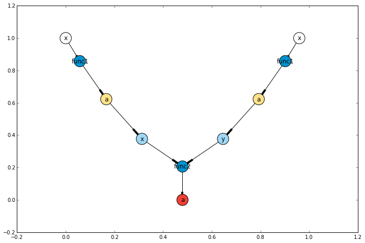

Workflow visualization using graphs
===================================

.. code:: python

    %pylab inline --no-import-all

.. parsed-literal::

    Populating the interactive namespace from numpy and matplotlib
    

Import wowp
-----------

.. code:: python

    from wowp import *
    from wowp.components import draw_graph

Create a simple workflow
------------------------

.. code:: python

    from wowp.actors import FuncActor
    
    def func1(x) -> ('a'):
        return x * 2
    
    def func2(x, y) -> ('a'):
        return x + y
    
    # create function actors
    in_actor1 = FuncActor(func1)
    in_actor2 = FuncActor(func1)
    out_actor = FuncActor(func2)
    
    # connect actors
    out_actor.inports['x'] += in_actor1.outports['a']
    out_actor.inports['y'] += in_actor2.outports['a']

Get workflow graph
------------------

The ``graph`` of any actor generates a ``NetworX.DiGraph`` obejct,
describing the actor connections (i.e. the workflow).

.. code:: python

    graph = out_actor.graph

Graphs can be easily plotted using ``draw_graph``.

.. code:: python

    plt.subplots(figsize=(12, 8))
    draw_graph(graph)

